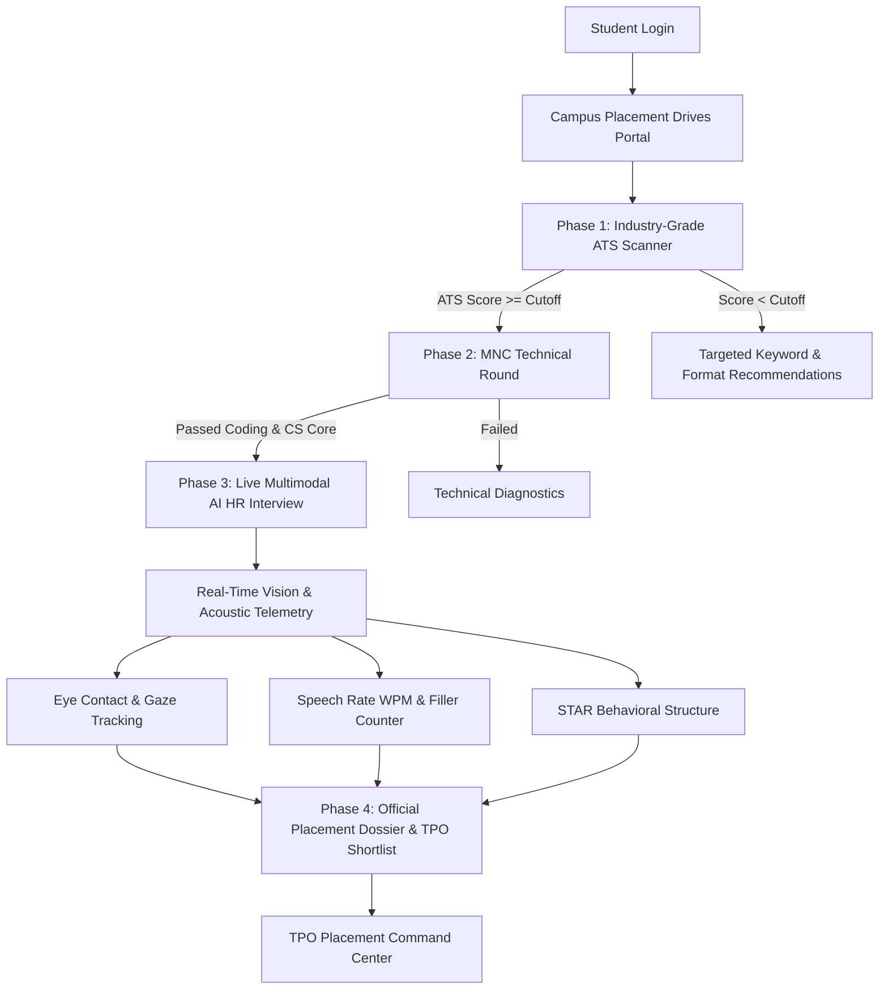

# TalentPulse AI — Campus Recruitment & Interview Intelligence Platform

> **Final Year Engineering Capstone Project**  
> An intelligent, end-to-end recruitment platform empowering College Training & Placement Offices (TPOs), students, and corporate recruiters.

[](https://react.dev/)
[](https://vitejs.dev/)
[](https://tailwindcss.com/)
[](LICENSE)

---

## 📌 Executive Summary & Problem Statement

University campus placements involve thousands of students and dozens of visiting MNCs (Amazon, TCS, Infosys, FinTech). Colleges struggle with:
1. **Manual Resume Screening Bottlenecks:** TPOs spend days sifting through resumes without standardized industry ATS scoring.
2. **Generic Technical Assessments:** Traditional multiple-choice tests fail to evaluate real-time algorithmic problem solving or proctored code integrity.
3. **The Soft-Skill / Behavioral Blindspot:** 70% of candidate rejections happen during HR interviews due to speech filler words, poor eye contact, or unstructured answers (lack of STAR method).

**TalentPulse AI** bridges this gap by providing an end-to-end AI-assisted recruitment platform tailored for universities and modern recruiters.

---

## 🏛️ Core Platform Architecture



---

## 🌟 The 4 Core Pillars

### 1. 📄 Industry-Grade ATS Resume Scanner
- Multi-factor heuristic evaluation inspired by modern ATS platforms (Workday, Greenhouse, Taleo).
- Evaluates:
  - **Hard & Soft Skills Match %** against target job descriptions.
  - **Metric Quantification Score:** Detects quantifiable project outcomes (e.g. *"reduced latency by 42%"*).
  - **Formatting Red Flags:** Missing contacts, incomplete sections, or unparseable structures.
  - **1-Click Benchmark Profiles:** Instant testing for High-Match (92%), Average (68%), and Flawed (41%) resumes.

### 2. 💻 MNC-Style Technical Assessment
- **Section 1 (Core CS):** Operating Systems (Deadlocks), DBMS (B+ Trees), DSA (Hash tables), Computer Networks (TCP Handshake).
- **Section 2 (Algorithmic Code Runner):** In-browser JavaScript execution sandbox with automated test cases and execution latency measurement.
- **Proctoring Suite:** Real-time tab-switching detection with automated integrity penalty scoring.

### 3. 🎙️ Live Multimodal AI HR Interview Studio
- **Animated AI HR Persona ("Sarah Jenkins"):** Voice output via Web Speech synthesis and dynamic audio visualizer waveforms.
- **Client-Side Computer Vision HUD (60 FPS):**
  - Real-time **Eye-Contact Ratio (%)** with gaze center target reticle.
  - **Facial Sentiment & Confidence Index** (`Confident & Focused`, `Attentive`, `Slightly Nervous`).
  - **Posture Stability Meter** measuring fidgeting/motion variance.
- **Speech Acoustics Engine:** Words Per Minute (WPM) tracking and real-time filler words counter (`"um"`, `"uh"`, `"like"`).

### 4. 🏆 Placement Dossier & TPO Command Hub
- **Student Placement Dossier:** Printable diagnostic card featuring an interactive 5-axis SVG Competency Radar Chart (ATS Match, Technical Depth, Communication, Eye Contact, STAR Rigor).
- **TPO Placement Command Center:** Master Candidate Leaderboard with sorting, drive filters, student deep-dive inspection modals, and **One-Click Batch CSV Export** for college placement records.

---

## 🚀 Quickstart Guide

### Prerequisites
- [Node.js](https://nodejs.org/) (v20+ recommended)
- [npm](https://www.npmjs.com/) (v9+)

### Installation & Local Run
```bash
# Clone the repository
git clone https://github.com/Atharva4711/talentpulse-ai.git
cd talentpulse-ai

# Install dependencies
npm install

# Start Vite development server
npm run dev
```
Open **[http://localhost:5173/](http://localhost:5173/)** in your browser.

### Production Build
```bash
npm run build
npm run preview
```

### Docker Deployment
```bash
# Spin up production container with Nginx
docker-compose up -d
```
Accessible at **http://localhost:3000**.

---

## 🔬 Benchmark Comparison with Industry Solutions

| Dimension | HireVue | Superset (College Standard) | TalentPulse AI (Our Capstone) |
| :--- | :--- | :--- | :--- |
| **Primary Scope** | Corporate Enterprise | University Placement Cell | Integrated Campus-to-Recruiter Pipeline |
| **Resume ATS Parser** | Integration only | Basic profile fields | Built-in Industry ATS Scorer & Keyword Advisor |
| **Technical Code Runner** | Third-party plugin | None / External links | Built-in in-browser Sandbox & Proctoring |
| **Live Vision Telemetry** | Server-side recording | None | Real-Time 60 FPS Client-Side Gaze HUD |
| **Viva Readiness** | Requires live cloud subscription | Enterprise license | Built-in Dual-Mode (Cloud + Zero-Failure Local) |

---

## 👥 Authors & Academic Credits
- **Project Lead & Developer:** Atharva ([@Atharva4711](https://github.com/Atharva4711))  
- **Project Domain:** Final Year B.Tech Computer Science Capstone Project  
- **Year:** 2026
